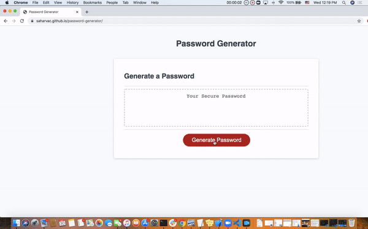
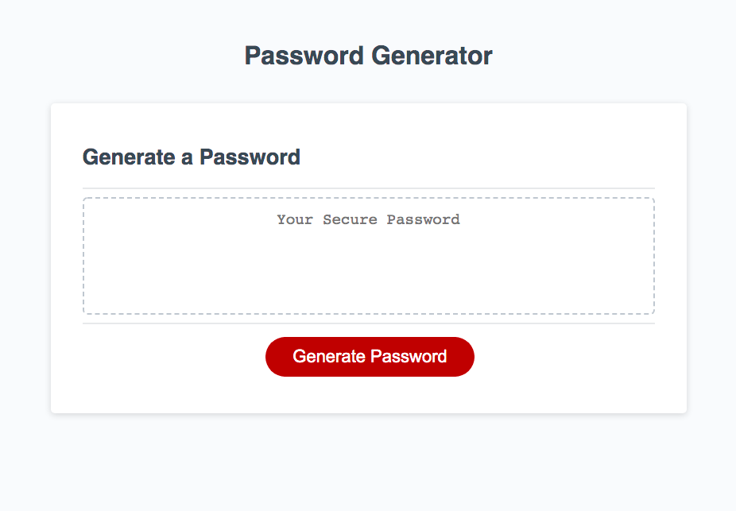
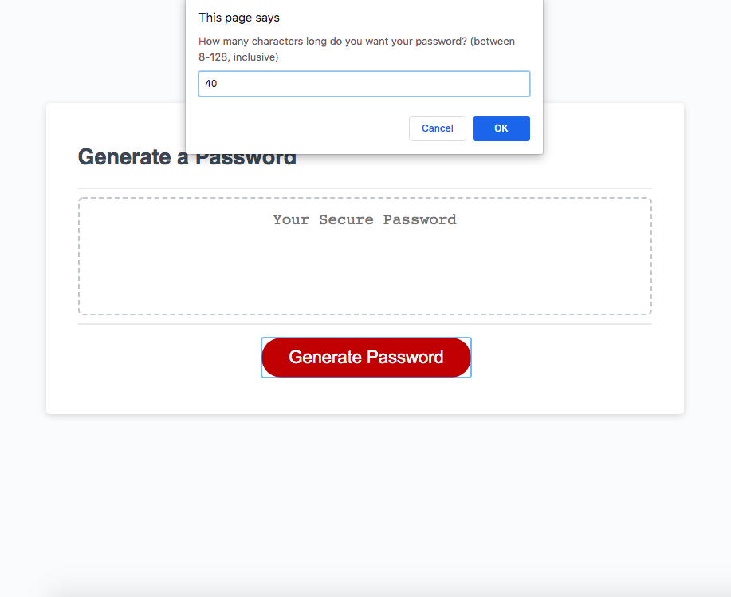
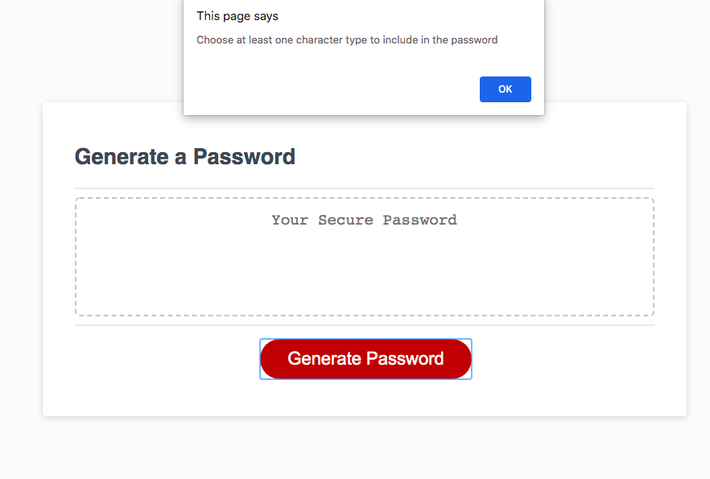
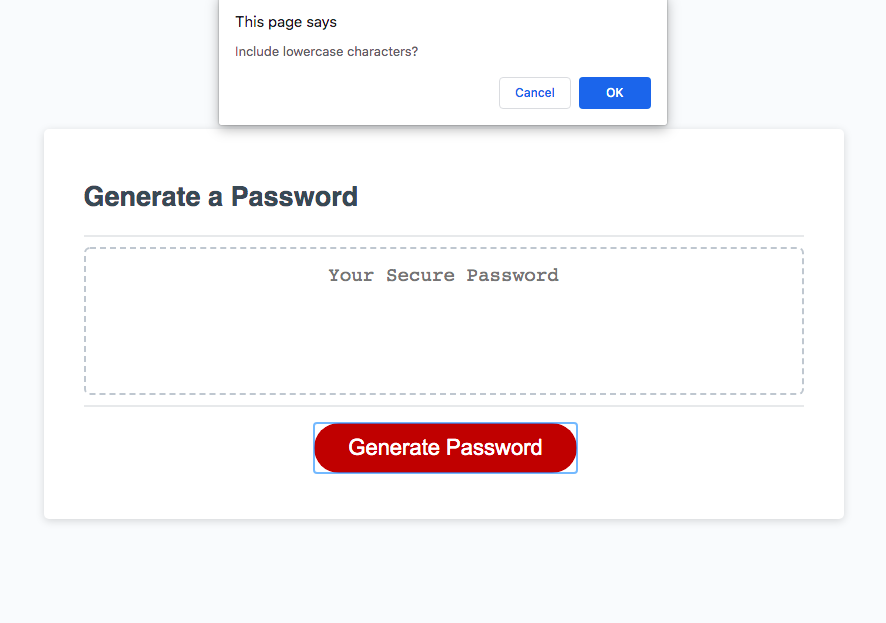
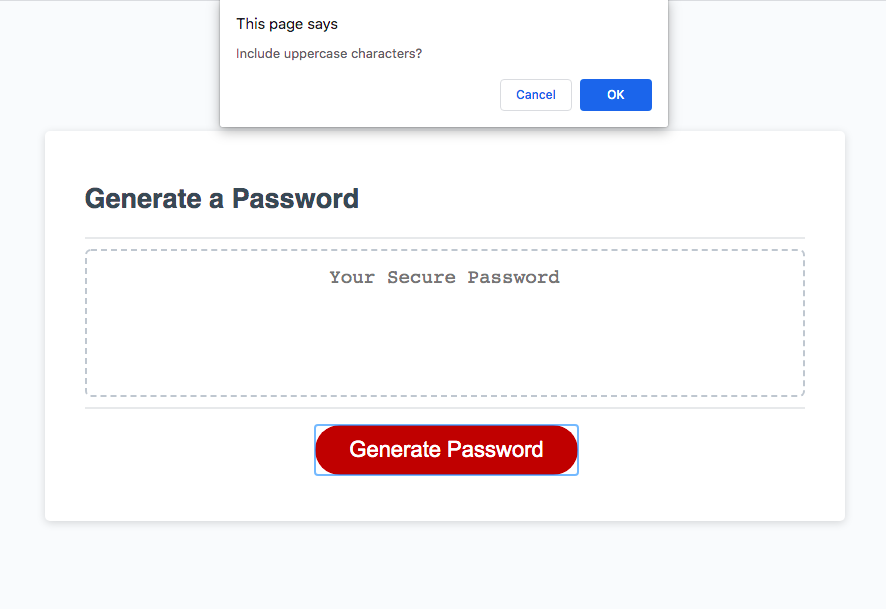
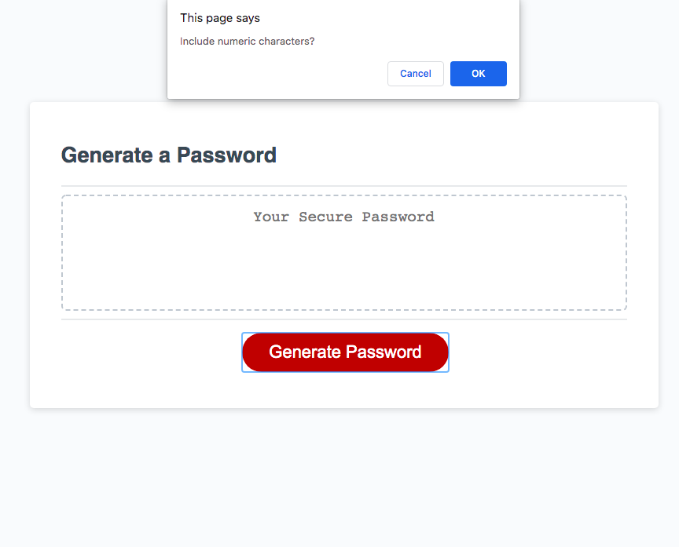
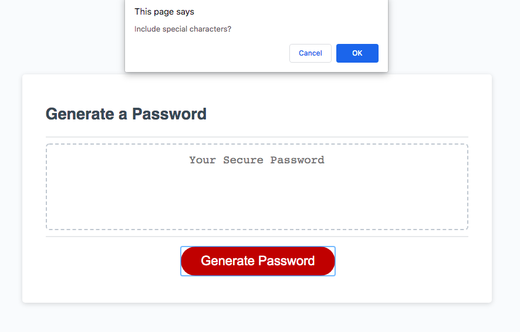
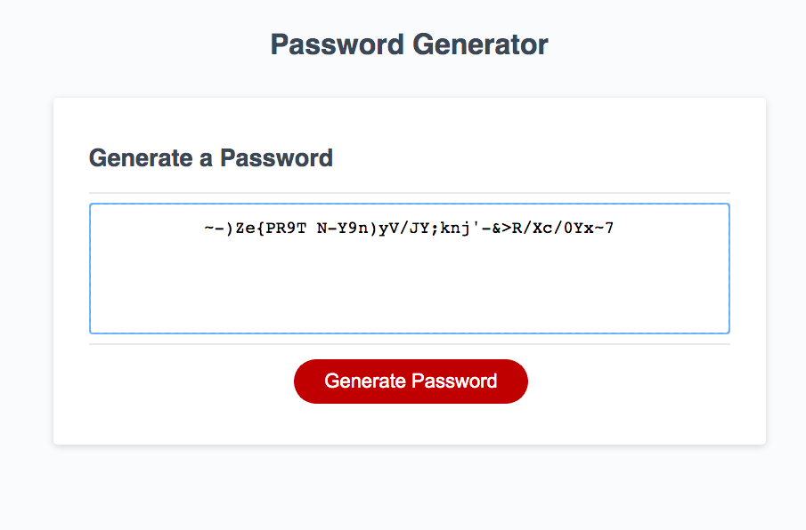

# Password Generator

This password generator takes into consideration the possible character types you might want in your password: uppercase, lowercase, numeric and special characters. I wrote the function that generates the password. I learned how I should work with prompts and confirms when taking in user input.

## HW repository

https://github.com/saharVac/password-generator

## Deployed version of the app

https://saharvac.github.io/password-generator/

## Running the application

Page is easily navigable, refer to the following gif and screenshots:

## Website used

I used this page to get a full list of special characters:
https://owasp.org/www-community/password-special-characters

The following helped me put images onto this README:
https://guides.github.com/features/mastering-markdown/
